

# A Multi-Reference Style and Multi-Modal Context-Awareness Zero-Shot Style Alignment for Image Generation

### Copyright © 2024 Alessio Borgi
### Paper: ...LOADING...

### **Abstract**
This work introduces a novel framework for **Zero-Shot Style Alignment** in **Text-to-Image (T2I) Image Generation**, which integrates **Multi-Modal Context-Awareness** and **Multi-Reference Style Alignment**. Our method differs from traditional current T2I approaches, which excel in creating visually compelling images from textual descriptions, but they often struggle to maintain a consistent style across multiple images generated. To address this, they require extensive fine-tuning and manual intervention. Behind this framework, two important building blocks, **Shared Attention** and **Adaptive Instance Normalization (AdaIN)** enable consistent style alignment across multiple images while maintaining diversity and minimizing content leakage. 
This work can be considered an extension of the **Google Research** [StyleAligned](https://arxiv.org/abs/2312.02133) work. We advanced the research by leveraging multiple content sources, such as images, audio, weather data, and music, to generate richer, multi-modal textual descriptions. By utilizing models like **BLIP-1**, **Whisper**, and **CLAP**, we enhance the diversity and contextual accuracy of the generated embeddings, employing also **T5 Summarization Model** for the final combined textual description if needed. For what concerns the **Multi-Reference Style Alignment**, we employ **Advanced Blending** techniques, including **Linear Weighted Blending** and **Spherical Interpolation (SLERP)**, to refine the multi-reference style alignment, allowing more than 1 reference style to influence the style contribution over the generated set of images.

Finally, we introduce a ***new metric***, **Weighted Multi-Style DINO VIT-B/8**, to better evaluate the style blending process. Our framework demonstrates the ability to weight and combine various reference styles, enhancing the control and flexibility in generating stylistically consistent images from diverse inputs.

    

        
        
        
        
    

### **StyleAligned's Keypoints**

-   **Zero-Shot Style Alignment**: Achieve consistent style alignment without the need for optimization or fine-tuning.
-	**Minimal Attention Sharing**: Introduces attention sharing during the diffusion process for seamless style transfer.
-	**High-Quality Synthesis**: Maintains high fidelity to text prompts while ensuring stylistic coherence.
-	**Ease of Use**: Simplifies the process of generating a series of stylistically aligned images.
-   **Inversion Operation**: Used to apply reference styles, ensuring stylistic coherence.

We propose three primary applications of StyleAligned:
1.	**StyleAligned with Prompts Only**: Demonstrates the simplicity and effectiveness of achieving style alignment using only **Input Text Prompts**.
2.	**StyleAligned with Reference Image**: Utilizes **Reference Images** to guide the style alignment process, ensuring consistent style transfer across multiple outputs, depending on it.
3.	**StyleAligned with ControlNet**: Incorporates **ControlNet**, which can be provided with **Depth Images** or **Edge Images (Canny Images)**, to enhance control over the style alignment process.
4.	**StyleAligned with Multi-Reference Images**: Utilizes **Multiple Reference Images** to guide the style alignment process, with the ability to blend them depending on a **Linear Weighted Interpolation** or a **Spherical Weighted Interpolation (SLERP Weighted)**.
5.	**StyleAligned with Multi-Modal Context-Awareness**: Added the possibility to provide multiple content sources, such as images, audio, weather data, and music, to generate richer, multi-modal textual descriptions. 

### **Related Work**
S.O.T.A. solutions all need for **Fine-Tuning** a T2I Model, over a set of images that share the same style. From this, some **Drawbacks** like **Computationally Expensiveness** and **Human intervention**, are important requirements to find a plausible set of images and the need for lots of data. Other similar works come from [Style-Drop](https://arxiv.org/abs/2306.00983), which employs Adapter Tuning and Iterative Training with Feedback to fine-tune the T2I Model. Another is [Style-Fit](https://arxiv.org/abs/1906.02913) which is based on two-stage peer-regularization layers, leveraging geometric deep learning.

Following [StyleAligned](https://arxiv.org/abs/2312.02133) approach, we show that high-quality, stylistically aligned image sets can be achieved with minimal intervention, enhancing the utility of T2I models for applications such as visual storytelling, artistic creation, and design. The method operates without the need for extensive optimization or fine-tuning, distinguishing it as a zero-shot solution. Evaluation across diverse styles and text prompts demonstrates the high-quality synthesis and fidelity of our method, underscoring its efficacy in achieving consistent style across various inputs. 

### **Shared Attention and Adaptive Instance Normalization (AdaIN)**

The **Shared Attention** Mechanism is an extension of the standard self-attention mechanism that allows for transferring style from a reference image to the rest of the images in the batch. While in **Standard Self-Attention**, the query attends to its own keys and values, we have that in ****Shared Attention**, the query not only attends to its own keys and values but also to those of a reference image. 

**AdaIN** is used to align the feature statistics (mean and variance) of a target image to match those of a reference image, facilitating style transfer.
The Final Outcome will be that the distribution (mean and standard deviation) of each target image’s query and key is aligned to match those of the reference image. This shared attention mechanism and AdaIN combine to allow the model to effectively transfer style across batches by utilizing key statistical information from a single reference image.

### **Installation**

To get started with StyleAligned, follow these steps:
1.	Clone the Repository: `git clone https://github.com/alessioborgi/StyleAlignedDiffModels.git`
2.  Navigate to the project directory:    `cd StyleAlignedDiffModels`
3.  Install the required dependencies:    `pip install -r requirements.txt`

### **Notebook Instructions**
1.	**StyleAligned_with_Prompts_only.ipynb**
	-	**Purpose**: Demonstrates the simplicity and effectiveness of achieving style alignment using only text prompts.
	-	**Run**: Use this notebook to generate stylistically coherent images from textual descriptions without the need for reference images.
	-	**Command**: `jupyter notebook StyleAligned_with_Prompts_only.ipynb`

    

        
        
        
        
    

In the following example, you can see the difference of StyleAlignment with and without the StyleAligned application:
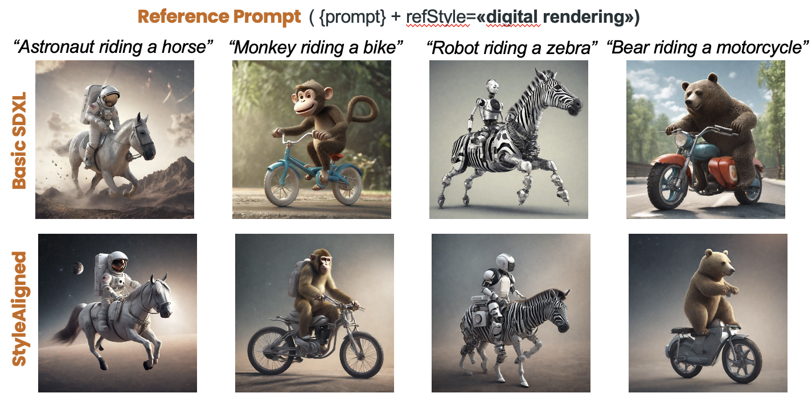
	
2.	**StyleAligned_with_Reference.ipynb**
	-	**Purpose**:  Illustrates style alignment using reference images to guide the process.
	-	**Run**: Use this notebook to apply a reference style across multiple generated images, ensuring consistent style transfer.
	-	**Command**: `jupyter notebook StyleAligned_with_Reference.ipynb`

    

        
        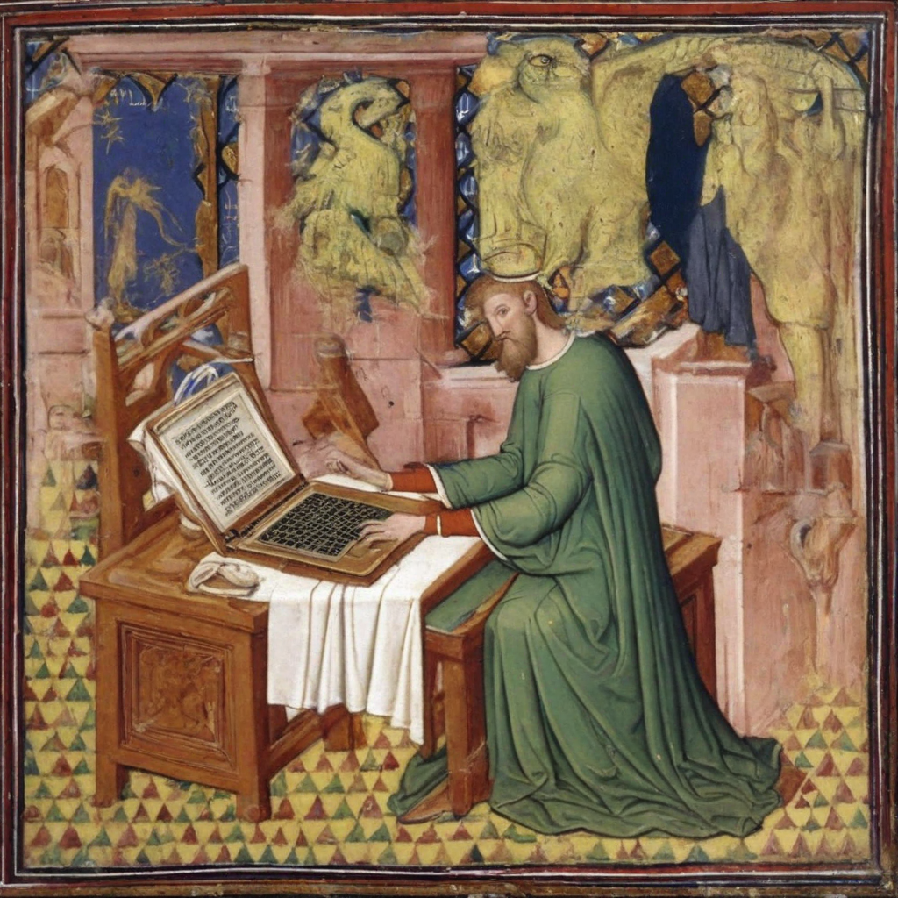
        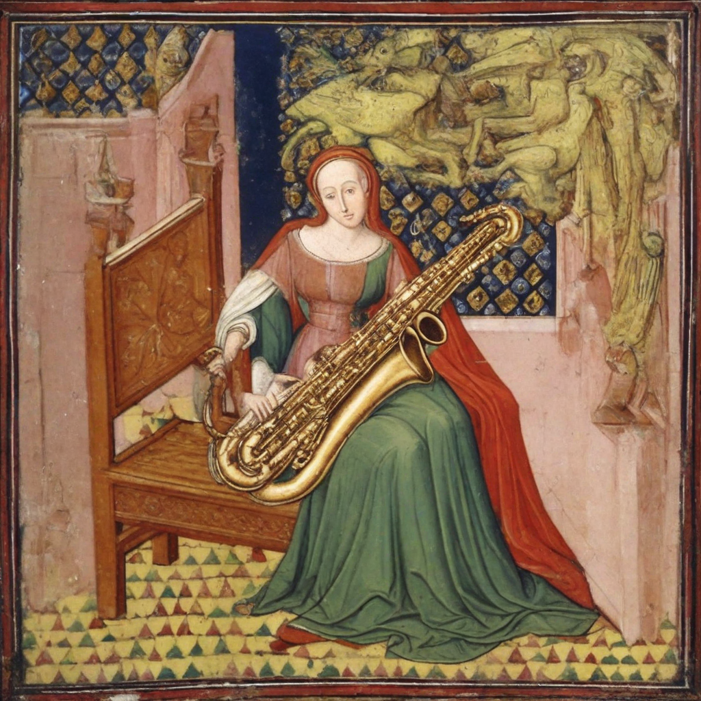
        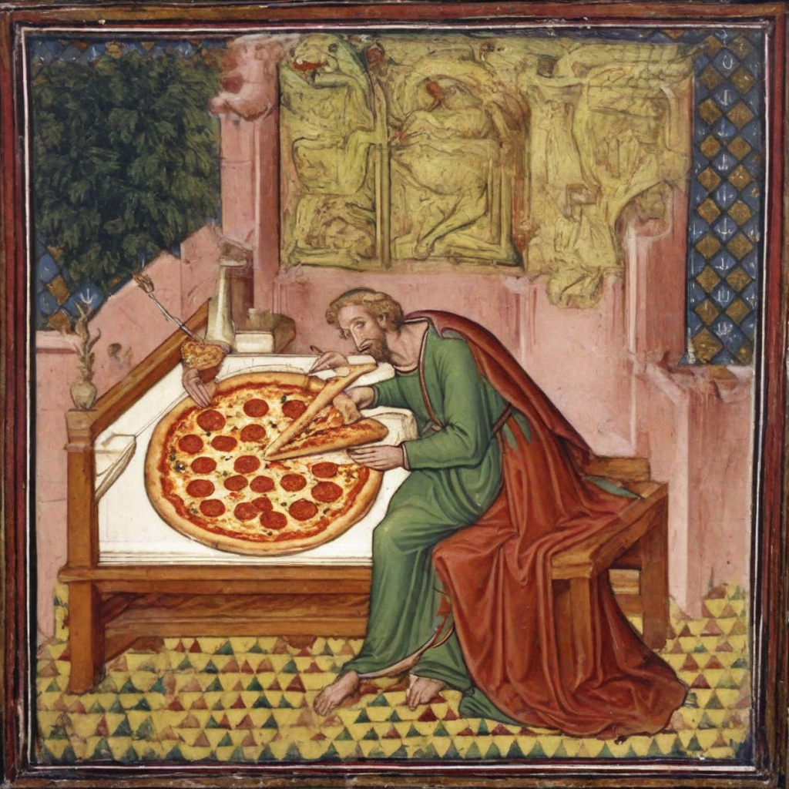
    

Another couple of examples we have for the Reference Style are: 

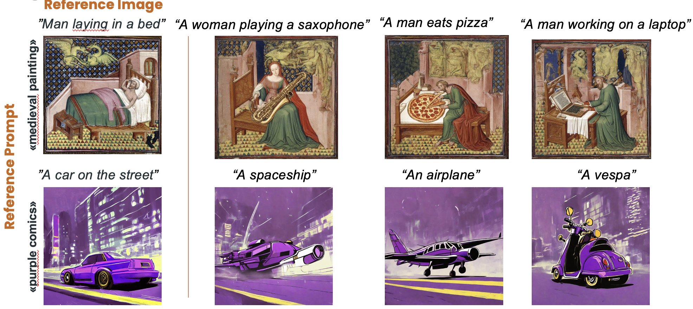

In the following example, you can also see how, in certain cases, when the **Reference Image** is **too famous**, we will get too much StyleAlignment. For this reason, we will make use of the trick introduced in [StyleAligned](https://arxiv.org/abs/2312.02133), where we will have an **Attention Score Rescaling**

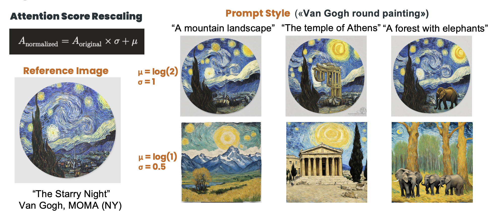

3.	**StyleAligned_ControlNet.ipynb**
	-	**Purpose**: Demonstrates how to control style alignment using specific parameters and ControlNet inputs (depth images or edge images (Canny Edges)).
	-	**Run**: Use this notebook to explore enhanced control over the style alignment process with ControlNet.
	-	**Command**: `jupyter notebook StyleAligned_ControlNet.ipynb`

Some examples come from the entire application of the **ControlNet** Model. We decided to present two examples: 
- **Depth Image**: Through **DPT (Dense Prediction Transformers) Model** from Intel, we decide to extract the **Depth Image** that will be used as **Control Image** over which we will apply the Reference Image.
- **Canny Edges Image**: Through the **Canny Edge Detection Algorithm**, we decided to apply the same idea.

	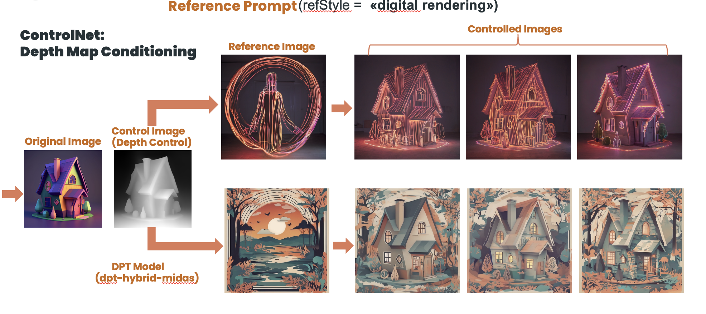
	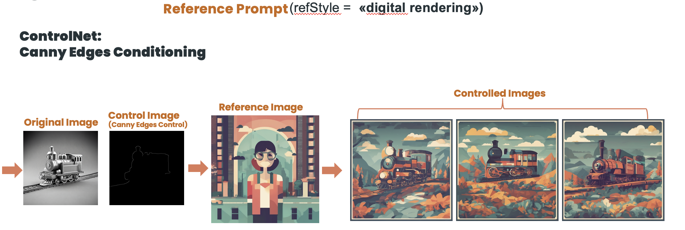

4.	**StyleAligned_Explanation.ipynb**
	-	**Purpose**:  Provides an in-depth explanation of the underlying methods and techniques used in StyleAligned, with detailed comments for each step involved.
	-	**Run**: Start here to understand the theoretical background, the inversion operation, and how attention sharing is achieved with minimal intervention. This comprises all the methods (both StyleAligned with Prompts, with Reference and with ControlNet).
	-	**Command**: `jupyter notebook StyleAligned_Explanation.ipynb`

### **Multi-Reference Style Alignment**
The **Multi-Reference Style Alignment** feature we introduce allows for **generating images** that **combine stylistic elements** from **multiple reference images**. This capability is essential for creating diverse and unique outputs where different styles can be blended seamlessly into one image. The key to this method is that we can also control how much influence each reference image contributes to the final result, offering a high level of customization.
In this task, we aim to guide a diffusion model in generating images that reflect the style characteristics of several reference images. This process occurs in the **latent space** of the image mode, which is crucial for combining different styles at a fundamental level before the final image is produced. We have developed two key techniques for combining styles from multiple reference images:
- **Linear Weighted Image Combination**: This is a simple and intuitive method for blending styles from multiple reference images. First, we compute the latent representation  $L_i$ (using a VAE)  for each reference style image  $T_i$ . Then, we multiply it by a scaling factor that represents the importance (or weight) of that image’s style. Finally, we blend all the latent representations together by computing a weighted sum.

- **Weighted SLERP (Spherical Linear Interpolation)**: SLERP is a more advanced technique that provides smoother and more natural transitions between different styles. It is particularly useful when the styles from reference images are very different from one another. Like the linear method, we start by calculating the latent representations for each reference style image. However, instead of blending the styles linearly, SLERP takes into account the geometric relationship between the latent representations in their high-dimensional space. Specifically, SLERP interpolates between the style vectors based on the angle between them, which results in more gradual and smooth style blending. 

**SLERP** offers a more advanced and effective way to blend multiple reference images in the latent space of generative models. Here’s why:
- **Handling Non-Linear Latent Space**:
	- **Linear Interpolation Issue**: In generative models like Stable Diffusion, the **latent space** is typically non-linear and lies on a **complex manifold**. Linear interpolation often causes the resulting latent vector to move outside the meaningful region of this space, leading to incoherent or unnatural results.
	- **SLERP Solution**: SLERP interpolates along the **surface of a hypersphere**, which respects the curvature of the latent space. This ensures that the generated latent vector stays within the meaningful area, resulting in a more coherent and natural blending of the source images.
- **Preserving Features and Details**:
	- **Linear Interpolation Issue**: Linear methods can sometimes produce a blended vector that overly favors one of the input styles or generates intermediate points that lose important details, making the results appear biased or unnatural.
	- **SLERP Solution**: By interpolating along the shortest path on a hypersphere, SLERP ensures a balanced combination of styles. This method maintains the proportions of features from both reference vectors, preserving essential details and producing more visually pleasing and balanced outputs.
- **Better Handling of Weighting Factors**:
	- **Linear Weighted Problem: Undesired Blending**
When using linear interpolation, the effect of the weight might not be as smooth or intuitive. The weights essentially scale the contributions from the two vectors, but the result may not always reflect the intended balance, especially in a non-linear latent space.
	- **SLERP Solution: Hypersphere Surface with Controlled Weights**. SLERP offers a more intuitive and natural way to balance the contributions of different styles. The weighting factor controls the degree of rotation between the vectors on the hypersphere, ensuring that the transition is smooth and the generated latent vector captures the appropriate balance between the input styles.

In summary, SLERP not only respects the underlying geometry of the latent space but also ensures smoother and more natural transitions between styles, making it superior to linear interpolation for style blending in image generation tasks.

You can observe the different approaches here in the following comparison:

	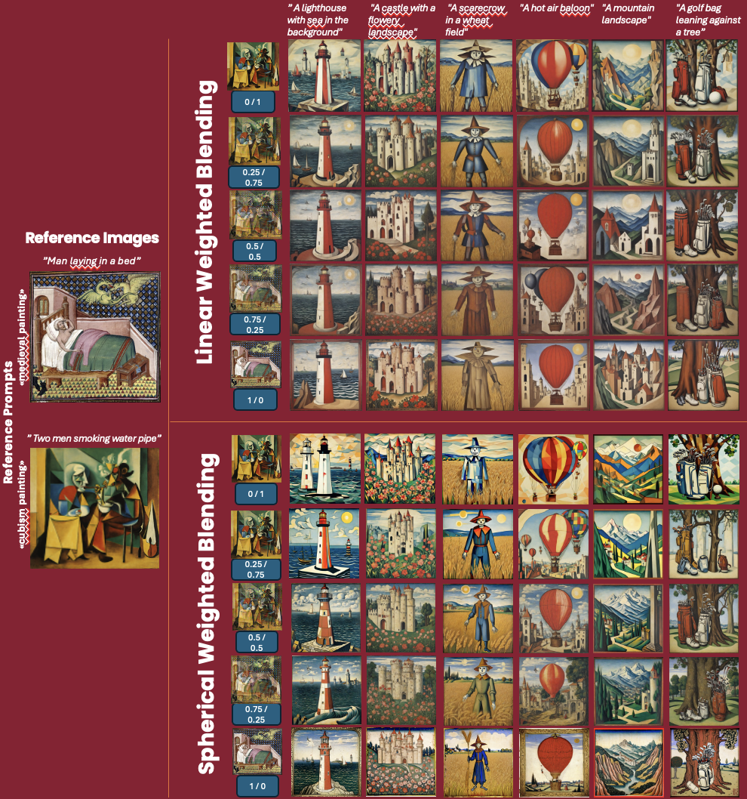

### **Multi-Modal Context-Awareness**

In our framework, we introduce **Multi-Modal Context-Awareness** to enhance the relevance and coherence of generated images by incorporating **diverse content sources** beyond just textual descriptions. This method captures information from various media inputs, to form rich contextual embeddings that improve the final output, including: 
- **Image Input**: Utilizing the **BLIP-1 (Bootstrapping Language-Image Pre-Training)** model from Salesforce, we extract detailed image-based textual descriptions that provide visual context.
- **Audio Input**: By integrating **Whisper (small)**, an **ASR(Automoatic Speech Recognition)** Model from OpenAI, we transcribe audio content into text, enabling image generation that aligns with spoken descriptions.
- **Weather Data**: The **OpenWeatherMap API** provides real-time environmental context, allowing for the adaptation of image generation to current weather conditions.
- **Music Input**: Using the **CLAP (Contrastive Language-Audio Pretraining) Model** in order to extract meaningful embeddings from the music files, that are then coupled, through similarity with some pre-established content embeddings, we interpret musical tones and rhythms to influence the aesthetic or emotional tone of the generated image. At the end, we also compute the **similarity** w.r.t. some pre-defined embeddings, in such a way as to provide for a sort of classification of the music genre.

These **modalities** might be **combined** to form comprehensive **Multi-Modal Textual Description Embeddings**, which are used in the style alignment and image generation process. By leveraging multiple sources of input, we can achieve more nuanced, contextually accurate, and diverse image outputs.

Examples include the simple **(Image) Context-Awareness**, **(Audio) Context-Awareness** or **(Image+Audio) Context-Awareness** as follows:

	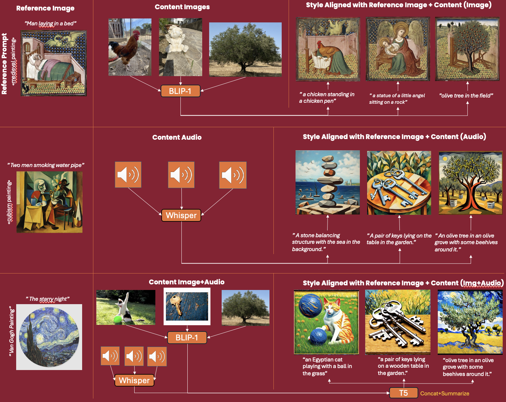

Another example we can make is the **(Image+Weather) Context-Awareness**:

	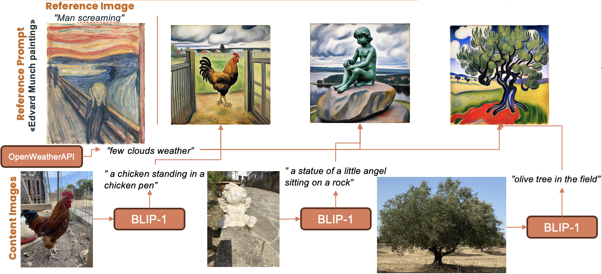

### **9: Evaluation Metrics**

A **Metrics Analysis** has also been provided w.r.t. the following, demonstrating the valuable insights of this technique:
- **Style Consistency: DINO Embedding Similarity:** DINO VIT-B/8 performs pairwise average cosine similarity between DINO embeddings of the generated images in each set. This measures style consistency. DINO better distinguishes between different styles due to its self-supervised training.

- **Text(Prompt)-Image Coherence: CLIP Embedding Similarity:** Clip embeddings Cosine similarity between the image and the text description of the object.

  
To verify that each generated image contains its specified object, we measure the **CLIP Cosine Similarity** between the image and the text description of the object. In addition, we evaluate the style consistency of each generated set, by measuring the **Pairwise Average Cosine Similarity** between **DINO VIT-B/8 Embeddings** of the generated images in each set. We used DINO embeddings instead of CLIP image embeddings for measuring image similarity, since CLIP was trained with class labels and therefore it might give a high score for different images in the set that have similar content but with a different style. On the other hand, DINO better distinguishes between different styles due to its self-supervised training.

|         MODEL 	|  CLIP  |  DINO  |
|-----------------------|--------|--------|
| SDXL (Non-Aligned) 	| 0.3454 | 0.3453 |
| Style-Aligned SDXL    | 0.3422 | 0.5018 |

### Style Alignment Explanation's Index**

- **0: SETTINGS & IMPORTS**
    - **0.1: CLONE REPOSITORY AND GIT SETUP**
    - **0.2: INSTALL AND IMPORT REQUIRED LIBRARIES**
- **1: UTILS IMPLEMENTATION**
    - **1.1: ADAIN MODULE**
    - **1.2: SHARED ATTENTION MECHANISM**
- **2: DDIM \& PIPELINE DEFINITION**
    - **2.1: DDIM SCHEDULER**
        - **2.1.1: DIFFUSION PROCESS**
        - **2.1.2: REVERSE PROCESS**
        - **2.1.3: BETA SCHEDULE**
        - **2.1.4: INFERENCE WITH DDIM**
    - **2.2: SDXL PIPELINE DEFINITION**
- **3: STYLE-ALIGNED WITH ONLY PROMPTS (WITHOUT REFERENCE IMAGE)**
- **4: STYLE-ALIGNED WITH REFERENCE IMAGE**
    - **4.1: LOADING REFERENCE IMAGE & SETTING PARAMETERS**
    - **4.2: FUNCTION FOR PROMPT TOKENIZATION & EMBEDDING**
    - **4.3: TEXT EMBEDDING ENSEMBLE METHOD**
    - **4.4: TEXT EMBEDDING: NEGATIVE CONDITIONING TECHNIQUE**
    - **4.5: ENCODE THE REFERENCE IMAGE**
    - **4.6: GENERATE NOISE PREDICTIONS**
    - **4.7: SINGLE DENOISING STEP in DIFFUSION PROCESS**
    - **4.8: DDIM (Denoising Diffusion Implicit Models) Denoising Process**
    - **4.9:  UPDATE LATENT TENSORS CALLBACK**
    - **4.10: STYLE-ALIGNED WITH REFERENCE IMAGE MAIN**
- **5: STYLE-ALIGNED WITH CONTROLNET**
    - **5.1: CONCATENATION WITH ZERO TENSORS: UTIL FUNCTION**
    - **5.2: CONTROLNET MODEL**
    - **5.3: CONTROL-NET WITH SIMPLE IMAGE & STYLE-ALIGNMENT**
    - **5.4: CONTROL-NET WITH DEPTH MAP & STYLE-ALIGNMENT**
    - **5.5: CONTROL-NET WITH EDGE MAP (CANNY DETECTOR) & STYLE-ALIGNMENT**

### **License**

This project is licensed under the MIT License - see the LICENSE file for details.

### **Acknowledgments**

We would like to thank **Google Research** for introducing the original concept of Style Alignment. A big thanks to my supervisors **Luca Maiano** and **Irene Amerini** for their unvaluable support in the process, and to my colleague **Francesco Danese** for the help in the original StyleAligned implementation.
